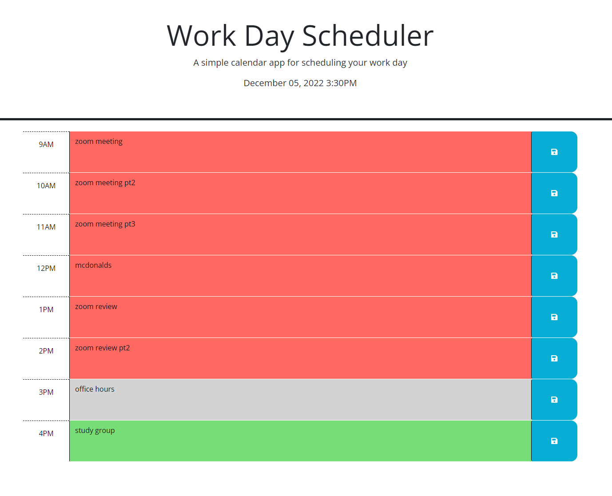

# Simple Calendar App

## Description

This is a functional day planner using local storage to save events and jquery to dynamically sort and list stored events. It updates the color coding on refresh, where green is future events, grey is curent events, and red is past events. It also uses dayjs to track the current time to list at the top and also compare to each div in html to properly color code. This project was made to be able to use a simple but effective planner that I would be capable of making.

## Table of Contents

- README file
- index.html: the main page which is formatted as a schedule with the time at the top and dynamically changing contents and colors
- script.js: this file contains the scripts use for the current time, event handlers, and functions to store data in local storage as well as add previous data to each section with proper coloring
- style.css: this contains basic css including seperate classes for each time section (past, present, and future)
- site-pic.png: a picture of the site with example plans